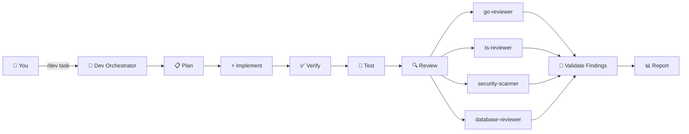

# ⚡ claude-code-superkit

<div align="center">

[](https://github.com/RaNDoM6913/claude-code-superkit/stargazers)
[](LICENSE)


**Production-tested agents, commands, hooks & skills for Claude Code and Codex CLI.**
**All agents on Opus. Maximum accuracy. Zero compromises.**

[🚀 Quick Start](#-installation) · [⌨️ Commands](#%EF%B8%8F-key-commands) · [📖 Guide](docs/guide/) · [❓ Troubleshooting](TROUBLESHOOTING.md) · [📋 Changelog](CHANGELOG.md)

</div>

---

Battle-tested in a production app with 68+ endpoints and 48 database migrations. Features double-verification code review, 3-layer documentation enforcement, AgentShield security scanning, and [SkillsMP](https://skillsmp.com) marketplace integration.

<table>
<tr>
<td width="50%">

### 🔍 Double-Verification Review
Every finding validated by an independent agent.
False positives eliminated before you see them.
Post inline comments on GitHub PRs with `--comment`.

</td>
<td width="50%">

### 📄 3-Layer Doc Enforcement
Rule + PreToolUse hook + Opus Stop hook.
Documentation never falls behind code.
Plan completion gate — docs before "done".

</td>
</tr>
<tr>
<td width="50%">

### 🛡️ Security Scanning
AgentShield (102 rules) + Red/Blue adversarial audit.
Config protection hook guards your standards.
CI integration included.

</td>
<td width="50%">

### 🔎 SkillsMP Integration
Search 500K+ community skills before building.
Keyword + AI semantic search via API.
Don't reinvent — discover and adapt.

</td>
</tr>
</table>

---

## 📦 What's Inside

| Component | Count | Description |
|-----------|-------|-------------|
| **Core Agents** | 20 | Code review, security scan, testing, audit, debugging, health checks, tree generation, DB review, architecture, doc validation — all on **Opus** |
| **Stack Agents** | 4 | Go, TypeScript, Python, Rust specialized reviewers |
| **Extra Agents** | 3 | Bot reviewer (Telegram/Discord/Slack), design system reviewer, red-blue auditor |
| **Extra Skills** | 1 | [SkillsMP](https://skillsmp.com) search — 500K+ community skills marketplace |
| **Commands** | 10 | `/dev`, `/review`, `/audit`, `/test`, `/lint`, `/migrate`, `/new-migration`, `/commit`, `/docs-init`, `/security-scan` |
| **Hooks** | 9 + 5 stack + Stop | Git safety, doc-check-on-commit, config-protection, format-on-edit, typecheck, context inject, session continuity |
| **Rules** | 5 | Coding style, security, git workflow, documentation (3-layer enforcement), auto dev workflow |
| **Skills** | 3 + 1 extra | Project architecture, writing-agents guide, writing-commands guide + SkillsMP search |

## 🆕 What's New (v1.1.0)

- 🔍 **Double-verification `/review`** — findings validated by independent agents, `--comment` posts to GitHub PRs
- 📄 **3-layer documentation enforcement** — rule + doc-check-on-commit hook + opus Stop hook
- 🔎 **SkillsMP integration** — search 500K+ community skills before building new ones
- 🧠 **All agents on Opus** — maximum reasoning depth for every task
- 🤖 **Codex: gpt-5.4 + extra_high** — maximum model and reasoning for Codex CLI
- 🆕 **New agents** — database-reviewer, architect, doc-updater (from ECC v1.9 research)
- 🔒 **Config protection hook** — warns when modifying linter/formatter configs

## 🔄 How it Works



## 🚀 Installation

### Claude Code (recommended)

```bash
git clone https://github.com/RaNDoM6913/claude-code-superkit.git
cd your-project/
bash /path/to/claude-code-superkit/setup.sh
```

Interactive installer: selects your stack (Go/TS/Python/Rust), hook profile (fast/standard/strict), auto-installs superpowers plugin. See [detailed guide](docs/INSTALL-CLAUDE-CODE.md).

### Codex CLI

Tell Codex:
```
Fetch and follow instructions from https://raw.githubusercontent.com/RaNDoM6913/claude-code-superkit/main/packages/codex/INSTALL.md
```

Or run `setup.sh` and select "Y" for Codex. Model: **gpt-5.4** + **extra_high** reasoning.

### After Installation

1. Edit `CLAUDE.md` — fill in your project details (replace TODO placeholders)
2. Edit `.claude/skills/project-architecture/SKILL.md` — describe your architecture
3. Run `claude` and try: `/review --full` or `/audit`

### ✅ Verify

Start a new Claude Code session and run `/review --full`. You should see agents dispatched and a findings report.

## ⌨️ Key Commands

| Command | What it does |
|---------|-------------|
| `/dev <task>` | 8-phase orchestrator: understand → plan → implement → verify → test → review → document → report |
| `/review [--comment]` | Detect changes → dispatch reviewers → **double-verify** findings → unified report (optionally post GitHub PR comments) |
| `/audit` | Parallel audit: up to 4 agents (frontend, backend, infra, security) |
| `/test` | Auto-detect stack and run tests |
| `/lint` | Auto-detect stack and run linters |
| `/commit` | Conventional commit with secret scanning |
| `/new-migration` | Create migration file pair (up + down) |
| `/migrate` | Apply or rollback database migrations |
| `/docs-init` | Scaffold architecture documentation |
| `/security-scan` | Run security scan on .claude/ configs |

## 🔧 Hook Profiles

Set `CLAUDE_HOOK_PROFILE` environment variable:

| Profile | Behavior |
|---------|----------|
| `fast` | Only git safety + console.log warning |
| `standard` (default) | All core hooks + stack formatters |
| `strict` | Everything + go vet on every edit + stop verification |

## ❓ Troubleshooting

See [TROUBLESHOOTING.md](TROUBLESHOOTING.md) for common issues, platform-specific guidance, and FAQ.

## 🛡️ Security Scanning

Scan your `.claude/` configurations for vulnerabilities with [AgentShield](https://github.com/affaan-m/agentshield):

```bash
npx ecc-agentshield scan          # Quick scan (102 rules)
npx ecc-agentshield scan --fix    # Auto-fix safe issues
```

Or use the built-in command: `/security-scan`

CI integration included — see `.github/workflows/security.yml`.

## 🏗️ Showcase

See [`packages/showcase/`](packages/showcase/) for a real production example — a production social app with 27 agents, 16 commands, 10 hooks, 12 skills, and 5 rules.

<details>
<summary>📖 Documentation (12 chapters + 3 examples)</summary>

### Guide

| Chapter | Topic |
|---------|-------|
| [01 — Getting Started](docs/guide/01-getting-started.md) | Install in 5 minutes, first commands |
| [02 — Architecture](docs/guide/02-architecture.md) | How agents, commands, hooks, rules, skills work together |
| [03 — Writing Agents](docs/guide/03-writing-agents.md) | Agent format, 2-phase review, severity/confidence |
| [04 — Writing Commands](docs/guide/04-writing-commands.md) | Orchestrator pattern, agent dispatch |
| [05 — Writing Hooks](docs/guide/05-writing-hooks.md) | Hook types, JSON protocol, profiles |
| [06 — Writing Skills](docs/guide/06-writing-skills.md) | Knowledge skills, dynamic content |
| [07 — Writing Rules](docs/guide/07-writing-rules.md) | Always-in-context enforcement |
| [08 — Orchestration](docs/guide/08-orchestration.md) | Full pipeline: /dev → agents → report |
| [09 — Advanced Patterns](docs/guide/09-advanced-patterns.md) | Profiles, session continuity, CI/CD |
| [10 — Codex CLI Support](docs/guide/10-codex-support.md) | Codex integration, tool mapping, skill discovery |
| [11 — Documentation Architecture](docs/guide/11-documentation-architecture.md) | Doc templates, tree generation, enforcement |
| [12 — Security Scanning](docs/guide/12-security-scanning.md) | AgentShield, CI, Red Team/Blue Team |

### Examples

| Example | What you build |
|---------|---------------|
| [Agent from Scratch](docs/examples/agent-from-scratch.md) | Dockerfile reviewer agent (10 checks) |
| [Command Orchestrator](docs/examples/command-orchestrator.md) | /deploy command with 4 phases |
| [Hook Pipeline](docs/examples/hook-pipeline.md) | Format + lint on every edit |

</details>

<details>
<summary>🤝 Codex CLI Support</summary>

superkit works with both **Claude Code** and **OpenAI Codex CLI**:

| Feature | Claude Code | Codex CLI |
|---------|:-:|:-:|
| Model | Opus (per agent) | **gpt-5.4** (global config) |
| Agents / Skills | 27 agents | 36 skills (8 commands + 24 agents + 4 stack) |
| Commands | 10 (slash commands) | 8 (user-invocable skills) |
| Hooks | 14 + Stop | — (inline rules in AGENTS.md) |
| Rules | 5 (separate files) | Inline in AGENTS.md |
| Knowledge Skills | 3 + 1 extra | 3 (project-architecture, writing-agents, writing-commands) |
| Session continuity | Yes (hooks) | — |
| Subagent dispatch | Agent tool | spawn_agent |

`setup.sh` will ask: "Also install for Codex CLI?" — copies 36 skills and creates AGENTS.md + config.toml (`gpt-5.4`, `extra_high`).

See [Codex Installation Guide](packages/codex/INSTALL.md) for manual setup.

</details>

## ⚡ Using with Superpowers Plugin

This toolkit is **complementary** to the [Superpowers plugin](https://github.com/obra/superpowers):

- **superkit** = infrastructure (agents, hooks, commands, review pipeline)
- **superpowers** = process (TDD, debugging, brainstorming, verification)

Install both for the complete experience.

<details>
<summary>🧩 Recommended Companion Tools</summary>

### Skills (install separately)

| Skill | What | Link |
|-------|------|------|
| ui-ux-pro-max | Design system generation (161 rules, 71 styles, 73 fonts) | [GitHub](https://github.com/nextlevelbuilder/ui-ux-pro-max-skill) |
| app-store-preflight | iOS/macOS App Store review validator | [GitHub](https://github.com/truongduy2611/app-store-preflight-skills) |
| app-store-screenshots | AI-generated App Store screenshots — device frames + marketing copy (3.2K stars) | [GitHub](https://github.com/ParthJadhav/app-store-screenshots) |

### MCP Servers (add to .mcp.json)

| Server | What | Package |
|--------|------|---------|
| 21st.dev magic | UI component search/generation | `@21st-dev/magic@latest` |
| shadcn | shadcn/ui component library | `shadcn-mcp@latest` |
| playwright | Browser automation/screenshots | Plugin (built-in) |
| context7 | Library docs lookup | Plugin (built-in) |

### Repos & Platforms

| Resource | What | Link |
|----------|------|------|
| Everything Claude Code | 28 agents, 125 skills, 60 commands — comprehensive harness performance system | [GitHub](https://github.com/affaan-m/everything-claude-code) |
| SkillsMP | 500K+ agent skills marketplace with search API | [skillsmp.com](https://skillsmp.com) |
| 21st.dev | AI agent deployment + community UI components | [21st.dev](https://21st.dev) |

</details>

## 👥 Contributing

See [CONTRIBUTING.md](CONTRIBUTING.md) for how to add new stacks, agents, and hooks.

## 📄 License

MIT

---

<div align="center">

Made with ❤️ for the Claude Code community

</div>
