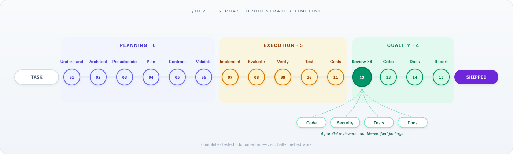
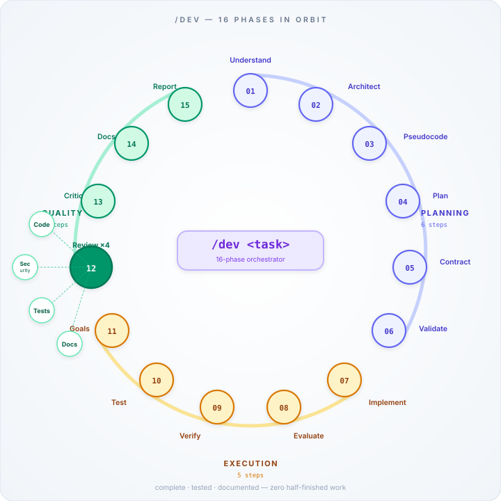
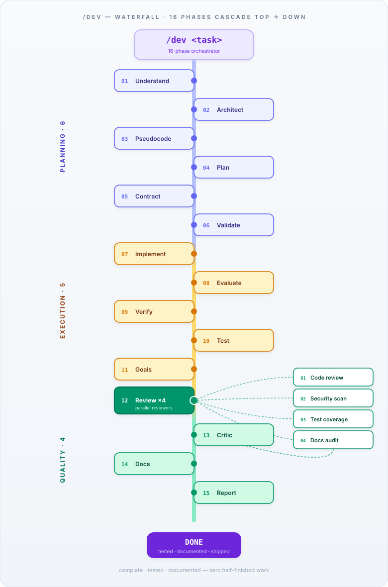
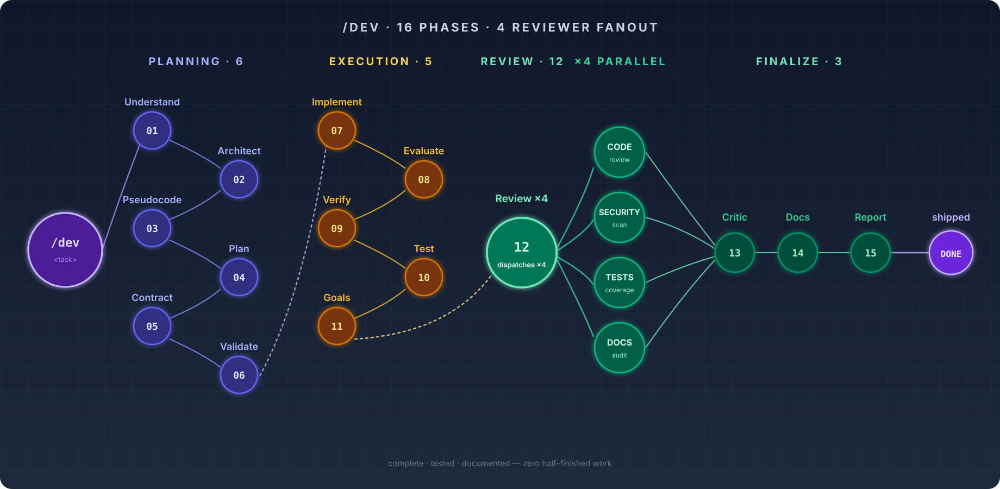

# `/dev` flow — 4 design variants

Four hand-authored SVG visualizations of the `/dev` 15-phase orchestrator. Each one shows the 4 parallel reviewers that run during Phase 12 (Review ×4) in a way that fits its composition.

Pick a number (1 / 2 / 7 / 9) and I'll wire it into the main `README.md`.

---

## 01 · Timeline horizontal
Linear left-to-right sequence. A gradient track carries 15 numbered nodes through three colored phase zones (Planning / Execution / Quality). At node 12 the track fans out into 4 reviewer pills below. The `/dev <task>` pill floats at top center instead of bracketing the timeline with input/output pills.

---

## 02 · Radial clock
All 15 phases orbit a central `/dev` core on a compact circle. Three colored arcs (indigo / amber / emerald) mark the phase boundaries around the rim. The Review step is a larger filled node with 4 small satellite reviewers clustered beside it.

---

## 07 · Waterfall vertical
Top-to-bottom cascade. Phases alternate left-right along a rainbow central spine. At Phase 12 the flow branches right into 4 reviewer cards, then merges back. Ends with a purple `DONE` pill.

---

## 09 · Node graph (dark schematic)
Dark-mode dataflow schematic. `/dev` glows on the left, then 6 Planning nodes zigzag into 5 Execution nodes, one bridge into the Review hub, which fans out to 4 parallel reviewer nodes (CODE / SECURITY / TESTS / DOCS), which merge back into Critic → Docs → Report → DONE. Every edge terminates on a real node — no floating lines.

---

## How to pick

- **Dev-friendly, fits directly in README hero** — 01 (timeline), 09 (node graph)
- **Shows dataflow + parallel review most clearly** — 09 (node graph)
- **Best at communicating "a cycle" rather than a pipeline** — 02 (radial)
- **Tall sidebar / long docs page** — 07 (waterfall)

Reply with a number (1 / 2 / 7 / 9) and I'll replace the current `docs/dev-flow.svg` reference in the root `README.md` with your pick.
