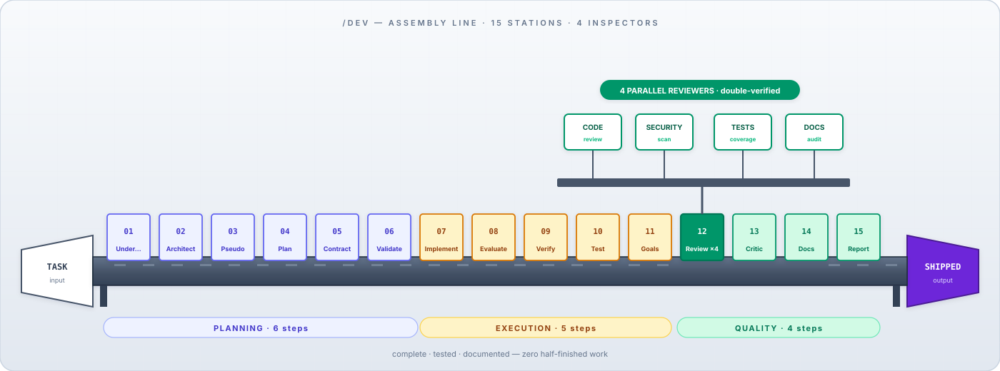
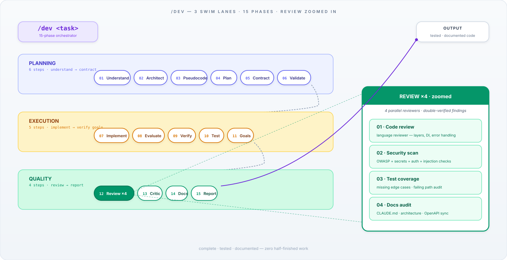
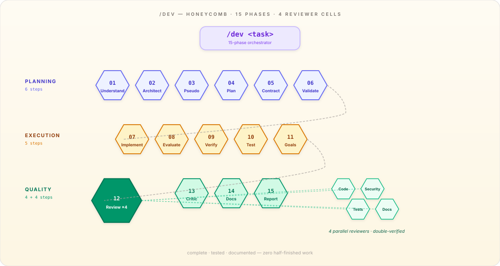
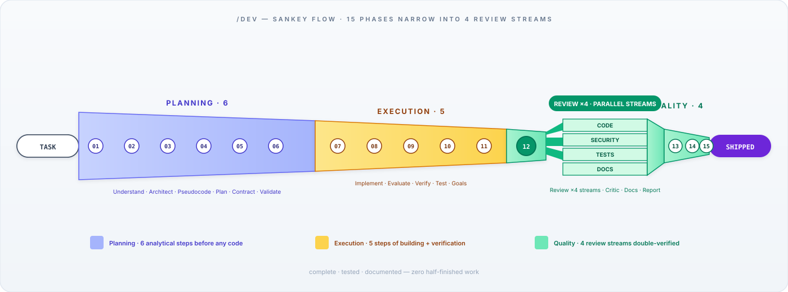
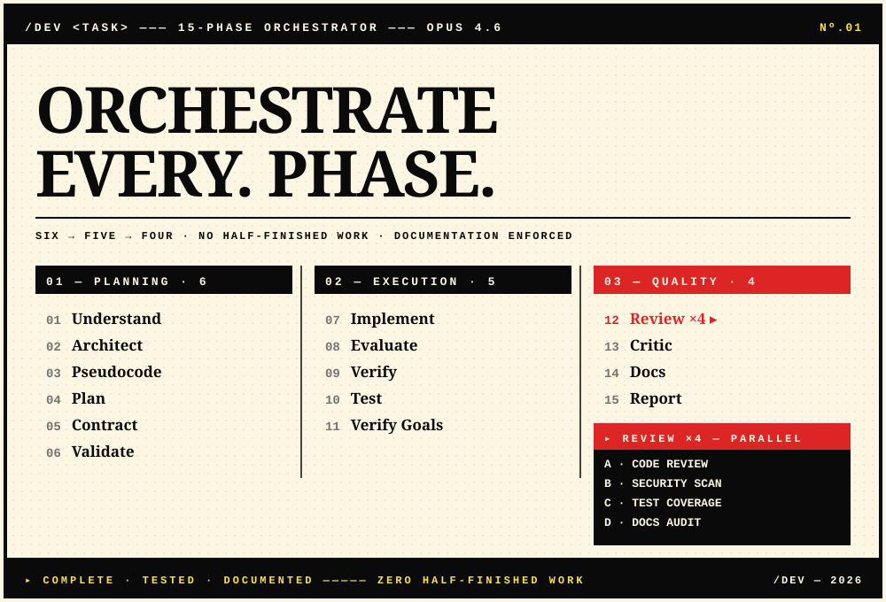
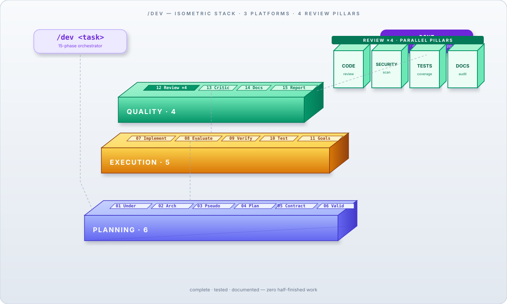

# `/dev` flow — 10 design variants

Ten distinct SVG visualizations of the `/dev` 15-phase orchestrator. Each one highlights the command flow differently and shows the 4 parallel reviewers that run during Phase 12 (Review ×4).

Pick the one you like best — tell me the number and I'll wire it into the main `README.md`.

---

## 01 · Timeline horizontal
Linear left-to-right sequence. `TASK` pill on the left, 15 numbered circles on a colored track, `SHIPPED` on the right. At node 12 the track fans out into 4 reviewer pills below.

---

## 02 · Radial clock
All 15 phases orbit the `/dev` command in the center. Phase arcs (indigo / amber / emerald) colour the outer rim. The Review step is a larger filled node with 4 small satellite discs for the 4 reviewers.

---

## 03 · Pipeline assembly line
Factory metaphor: task enters left, conveyor belt carries code through 15 stations (colored by phase), output ships right. Over the Review station, a tower of 4 inspector heads (CODE / SECURITY / TESTS / DOCS) checks the work.

---

## 04 · Swim lane + zoom panel
Three stacked swim lanes for Planning / Execution / Quality, each with numbered pills. On the right, a big zoom-in panel expands the Review ×4 step and lists each reviewer with a one-line description.

---

## 05 · Honeycomb hex
Each phase is a hexagonal tile in a honeycomb grid. Three rows for the three phases. The Review hex is larger and darker, with 4 smaller review child hexes clustered beside it.

---

## 06 · Sankey flow
Phases as colored bands that narrow as we progress (Planning wide → Execution narrower → Quality narrowest). At the Review point the band splits into 4 parallel streams (CODE / SECURITY / TESTS / DOCS), then rejoins into the final Critic/Docs/Report flow.

---

## 07 · Waterfall vertical
Top-to-bottom cascade. Phases alternate left-right along a rainbow central spine. At Phase 12 the flow branches right into 4 reviewer cards, then merges back. Ends with a purple `DONE` pill.

---

## 08 · Brutalist poster
Editorial poster aesthetic. Massive `ORCHESTRATE EVERY. PHASE.` headline. Three strict columns (Planning / Execution / Quality). The Quality column has a large black `REVIEW ×4` expansion block below it listing the 4 reviewers in high-contrast type.

---

## 09 · Node graph (dark schematic)
Dark-mode architect's schematic. `/dev` as a glowing core on the left, three phase clusters (indigo / amber / emerald) connected by curved bezier edges, Review fans out east to 4 bright reviewer nodes, `DONE` terminal on the far right.

---

## 10 · Isometric stack
Three 3D-looking platforms stacked with depth (Planning on the bottom, Execution middle, Quality on top). Above the top platform, four tall review "pillars" (CODE / SECURITY / TESTS / DOCS) rise over the Review step. `/dev` pill top-left, `DONE` top-right.

---

## How to choose

- **Most compact, fits in README hero** — 01 (timeline), 06 (sankey), 09 (node graph)
- **Most impactful visual identity** — 08 (brutalist), 09 (node graph), 10 (isometric)
- **Best at explaining what `/dev` actually does** — 03 (pipeline), 04 (swim lanes + zoom)
- **Most decorative / print-ready** — 02 (radial), 08 (brutalist), 10 (isometric)
- **Best for a tall sidebar / docs page** — 07 (waterfall)

Reply with a number (1–10) and I'll replace the current `docs/dev-flow.svg` reference in the root `README.md` with your pick.
