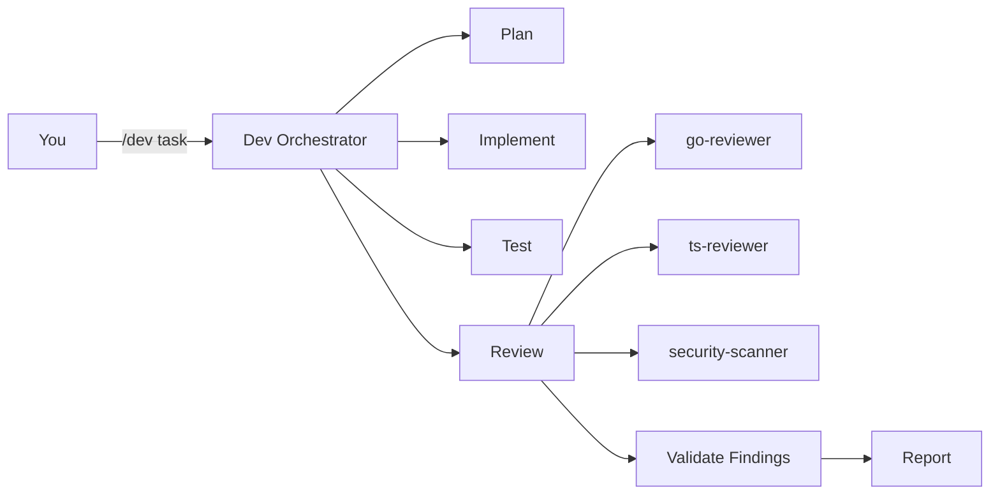

# План #33 — README Visual Polish

> **For agentic workers:** REQUIRED SUB-SKILL: Use superpowers:subagent-driven-development (recommended) or superpowers:executing-plans to implement this plan task-by-task. Steps use checkbox (`- [ ]`) syntax for tracking.

**Goal:** Улучшить визуальное восприятие README и общей стилистики проекта. Сделать профессионально и запоминающе, без перегруза.

**Architecture:** Только markdown + GitHub-native features. Никаких внешних зависимостей.

---

## Текущие проблемы

1. **Заголовок скучный** — просто `# claude-code-superkit` без визуального акцента
2. **Badges мелкие и невыразительные** — flat style, теряются
3. **"What's Inside" таблица** — сухие числа без визуального разделения
4. **Нет hero-описания** — сразу в техничку, нет "вау-эффекта"
5. **Секции сливаются** — нет визуальных разделителей между блоками
6. **Нет логотипа/иконки** — текстовый проект без визуального якоря
7. **Длинный README** — 200 строк без collapsible секций

---

## Варианты улучшения (выбрать)

### Вариант A: Минимальный polish (30 мин)

Добавить эмодзи в заголовки секций + улучшить badges:

```markdown
# ⚡ claude-code-superkit

## 📦 What's Inside
## 🆕 What's New (v1.1.0)
## 🚀 Installation
## ⌨️ Key Commands
## 🔧 Hook Profiles
## 📖 Documentation
## 🛡️ Security Scanning
## 🏗️ Showcase
## 🤝 Codex CLI Support
## 🧩 Recommended Companion Tools
```

**Плюсы:** быстро, не спорно, улучшает скан-навигацию
**Минусы:** минимальный эффект

---

### Вариант B: Средний polish (1-2 часа)

Вариант A + hero-секция + улучшенные badges + collapsible details:

```markdown
# ⚡ claude-code-superkit

<div align="center">

[](https://github.com/RaNDoM6913/claude-code-superkit/stargazers)
[](LICENSE)


**Production-tested agents, commands, hooks & skills for Claude Code and Codex CLI.**
**All agents on Opus. Maximum accuracy. Zero compromises.**

[Quick Start](#-installation) · [Commands](#%EF%B8%8F-key-commands) · [Guide](docs/guide/) · [Troubleshooting](TROUBLESHOOTING.md)

</div>

---
```

**Collapsible для длинных секций:**
```markdown
<details>
<summary>📖 Documentation (12 chapters + 3 examples)</summary>

| Chapter | Topic |
|---------|-------|
| ... | ... |

</details>
```

**Плюсы:** профессиональный вид, быстрая навигация, readable
**Минусы:** 1-2 часа работы

---

### Вариант C: Полный redesign (3-4 часа)

Вариант B + ASCII art header + feature highlight cards + architecture diagram:

```markdown
<div align="center">

```
 ___                      _    _ _
/ __|_  _ _ __  ___ _ _  | |__(_) |_
\__ \ || | '_ \/ -_) '_| | / /| |  _|
|___/\_,_| .__/\___|_|   |_\_\|_|\__|
         |_|     claude-code-superkit
```

</div>
```

**Feature cards (используя HTML в markdown):**
```markdown
<table>
<tr>
<td width="50%">

### 🔍 Double-Verification Review
Every finding validated by an independent agent.
False positives eliminated before you see them.

</td>
<td width="50%">

### 📄 3-Layer Doc Enforcement
Rule + PreToolUse hook + Opus Stop hook.
Documentation never falls behind code.

</td>
</tr>
<tr>
<td width="50%">

### 🛡️ Security Scanning
AgentShield + Red/Blue audit.
102 rules, adversarial analysis.

</td>
<td width="50%">

### 🔎 SkillsMP Search
500K+ community skills.
Search before building.

</td>
</tr>
</table>
```

**Architecture diagram (Mermaid — GitHub renders natively):**
```markdown

```

**Плюсы:** выглядит как серьёзный open-source проект, запоминается
**Минусы:** 3-4 часа, ASCII art может не всем нравиться

---

## Моя рекомендация: Вариант B+ (смесь B и C)

Берём из B:
- Centered hero с for-the-badge badges
- Quick navigation links
- Эмодзи в заголовках
- Collapsible для Documentation и Codex CLI

Берём из C:
- Feature highlight cards (4 ключевых фичи)
- Mermaid architecture diagram (в секции How it Works)

Пропускаем из C:
- ASCII art (спорный вкус)

---

## Задачи (если одобришь)

### Task 1: Hero секция

- [ ] Centered layout с большими badges (for-the-badge style)
- [ ] Tagline: "Production-tested agents, commands, hooks & skills"
- [ ] Quick nav links: Quick Start · Commands · Guide · Troubleshooting
- [ ] Horizontal rule `---` после hero

### Task 2: Эмодзи в заголовках

- [ ] Добавить к каждому `##` заголовку подходящий эмодзи:
  - `📦 What's Inside`
  - `🆕 What's New`
  - `🚀 Installation`
  - `⌨️ Key Commands`
  - `🔧 Hook Profiles`
  - `❓ Troubleshooting`
  - `📖 Documentation`
  - `🛡️ Security Scanning`
  - `🏗️ Showcase`
  - `🤝 Codex CLI Support`
  - `⚡ Using with Superpowers`
  - `🧩 Recommended Companion Tools`
  - `👥 Contributing`
  - `📄 License`

### Task 3: Feature highlight cards

- [ ] HTML table с 4 карточками ключевых фич (после What's Inside)
  - Double-Verification Review
  - 3-Layer Doc Enforcement
  - Security Scanning (AgentShield)
  - SkillsMP Search (500K+ skills)

### Task 4: Mermaid diagram

- [ ] Добавить "How it Works" секцию с mermaid graph
- [ ] Показать flow: user → /dev → plan → implement → review → agents → validate → report

### Task 5: Collapsible секции

- [ ] Documentation (12 chapters) — `<details><summary>`
- [ ] Codex CLI Support — `<details><summary>`
- [ ] Recommended Companion Tools — `<details><summary>`
- [ ] Это уберёт ~60 строк из "основного" вида README

### Task 6: Мелкие улучшения

- [ ] Добавить footer: `---` + "Made with ❤️ for Claude Code community"
- [ ] Убедиться что все ссылки рабочие
- [ ] Проверить рендер на GitHub (mermaid, badges, collapsible)

---

## Пример финального вида (примерная структура)

```
┌─────────────────────────────────────────────┐
│          ⚡ claude-code-superkit              │
│                                             │
│  [★ Stars] [MIT] [27 Opus] [gpt-5.4]       │
│                                             │
│  Production-tested agents, commands,        │
│  hooks & skills for Claude Code.            │
│                                             │
│  Quick Start · Commands · Guide · Help      │
├─────────────────────────────────────────────┤
│                                             │
│  📦 What's Inside         (table)           │
│                                             │
│  ┌──────────────┬──────────────┐            │
│  │ 🔍 Double    │ 📄 3-Layer   │            │
│  │ Verification │ Doc Enforce  │            │
│  ├──────────────┼──────────────┤            │
│  │ 🛡️ Security │ 🔎 SkillsMP  │            │
│  │ Scanning    │ 500K+ skills │            │
│  └──────────────┴──────────────┘            │
│                                             │
│  🆕 What's New (v1.1.0)    (list)          │
│                                             │
│  🚀 Installation            (code blocks)  │
│                                             │
│  ⌨️ Key Commands            (table)         │
│                                             │
│  🔧 Hook Profiles           (table)         │
│                                             │
│  ▸ 📖 Documentation         (collapsed)     │
│  ▸ 🤝 Codex CLI Support     (collapsed)     │
│  ▸ 🧩 Companion Tools       (collapsed)     │
│                                             │
│  👥 Contributing                            │
│  📄 License: MIT                            │
│                                             │
│  ─────────────────────────────────────      │
│  Made with ❤️ for Claude Code community     │
└─────────────────────────────────────────────┘
```

---

## Оценка

| Task | Усилия | Приоритет |
|------|--------|-----------|
| 1. Hero секция | 30 мин | HIGH |
| 2. Эмодзи заголовки | 15 мин | HIGH |
| 3. Feature cards | 30 мин | MEDIUM |
| 4. Mermaid diagram | 20 мин | MEDIUM |
| 5. Collapsible | 20 мин | MEDIUM |
| 6. Footer + проверка | 15 мин | LOW |
| **Total** | **~2 часа** | |
