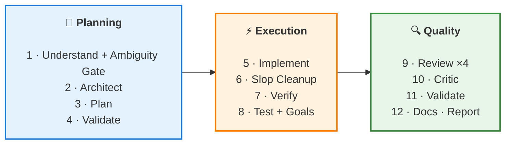

# OMC-Inspired Enhancements Implementation Plan

> **For agentic workers:** REQUIRED SUB-SKILL: Use superpowers:subagent-driven-development (recommended) or superpowers:executing-plans to implement this plan task-by-task. Steps use checkbox (`- [ ]`) syntax for tracking.

**Goal:** Integrate 8 high-value features inspired by oh-my-claudecode into superkit — new agents, command improvements, commit trailers, and full documentation sync.

**Architecture:** Each enhancement is an independent markdown file (agent/command/hook) following existing superkit conventions. No TypeScript, no npm dependencies — pure markdown + shell. Each task produces one commit.

**Tech Stack:** Markdown (YAML frontmatter), Bash (hooks), Mermaid (diagram)

---

## Task 1: AI Slop Cleaner Agent

**Files:**
- Create: `packages/core/agents/ai-slop-cleaner.md`

- [ ] **Step 1: Create the agent file**

```markdown
---
name: ai-slop-cleaner
description: Clean AI-generated code patterns — redundant comments, unnecessary abstractions, over-engineering, template code
model: opus
allowed-tools: Read, Grep, Glob, Edit
---

# AI Slop Cleaner

Detect and fix common AI-generated code anti-patterns. Behavior-preserving cleanup — no logic changes, only readability and quality improvements.

## Phase 0: Load Project Context

Read if exists:
1. `CLAUDE.md` or `AGENTS.md` — project conventions, coding style
2. `.editorconfig` or linter configs — formatting rules

**Use this context to:** distinguish project conventions from AI slop (e.g., the project MAY want verbose comments).

## When to Use

- After AI-assisted implementation (post Phase 3 in /dev)
- Before code review (catch slop before reviewers waste time on it)
- Standalone cleanup pass on existing codebase

## Detection Checklist

### Category 1: Redundant Comments (MOST COMMON)
```
// This function returns the user      ← states the obvious
// Import the http package             ← describes the import
// Create a new instance               ← describes the constructor
// Check if the value is nil           ← restates the code
// TODO: implement this                ← left by AI, not real TODO
```

**Action:** Remove comments that restate what the code already says. Keep comments that explain WHY, not WHAT.

### Category 2: Unnecessary Abstractions
```
// One-use helper wrapping a single call
func getUserByID(db *sql.DB, id string) (*User, error) {
    return db.QueryRow("SELECT ...").Scan(...)
}
// Called exactly ONCE
```

**Action:** Inline one-use helpers. If a function is called once and its name matches what it does, it's noise.

### Category 3: Over-Engineering
- Feature flags for non-configurable behavior
- Backwards-compatibility shims with zero consumers
- Strategy/factory patterns for 1 implementation
- Generic types where concrete types suffice
- Interface for a single implementation (no testing need)

**Action:** Replace with direct, simple code. YAGNI.

### Category 4: Template/Boilerplate Slop
- Empty error handlers (`catch (e) {}`)
- Unused function parameters (especially `_` placeholders)
- Default switch/match cases that can't be reached
- Unnecessary type assertions on already-typed values
- Re-exporting types that are never imported from the re-export

**Action:** Remove dead code. Trust the type system.

### Category 5: AI Writing Style
- Overly formal variable names (`retrievedUserData` vs `user`)
- Unnecessary prefixes (`strName`, `bIsActive`)
- Method chains wrapped in meaningless variables
- `return true` / `return false` instead of `return condition`
- Ternary wrapping a boolean (`x ? true : false`)

**Action:** Simplify to idiomatic style for the language.

## Process

1. **Scan** — Grep for patterns from each category across changed files
2. **Classify** — Group findings by category
3. **Filter** — Remove false positives (comments that DO add value, abstractions that ARE reused)
4. **Fix** — Apply fixes via Edit tool. ONE category at a time to keep diffs reviewable
5. **Verify** — Run compiler/linter after each category to ensure no breakage

## Output Format

### Severity
- **SLOP** — AI-generated noise. Safe to remove.
- **BORDERLINE** — Could go either way. Flag for human decision.

### Format:
```
[SLOP] file:line — description
  Pattern: <what was found>
  Fix: <what to change>

[BORDERLINE] file:line — description
  Pattern: <what was found>
  Reason it might be intentional: <explanation>
```

### Summary:
```
## AI Slop Cleanup Report

Scanned: N files
Found: X patterns (Y SLOP, Z BORDERLINE)
Fixed: W patterns
Skipped: V (borderline, left for human review)

Categories:
- Redundant comments: N removed
- Unnecessary abstractions: N inlined
- Over-engineering: N simplified
- Template slop: N cleaned
- AI writing style: N fixed
```

IMPORTANT: This agent ONLY cleans. It does NOT refactor logic, add features, or change behavior. Every fix must be provably behavior-preserving.
```

- [ ] **Step 2: Verify the file was created correctly**

Run: `head -5 packages/core/agents/ai-slop-cleaner.md`
Expected: YAML frontmatter with name, description, model: opus

- [ ] **Step 3: Commit**

```bash
git add packages/core/agents/ai-slop-cleaner.md
git commit -m "feat(agents): add ai-slop-cleaner — detect and fix AI-generated code patterns"
```

---

## Task 2: Critic Agent

**Files:**
- Create: `packages/core/agents/critic.md`

- [ ] **Step 1: Create the agent file**

```markdown
---
name: critic
description: Final quality gate — multi-perspective review (security, new-hire, ops) with gap analysis and pre-commitment predictions
model: opus
allowed-tools: Read, Grep, Glob, Bash
---

# Critic

Final quality gate before completion. Reviews implementation from 3 perspectives that specialized reviewers miss. Dispatched AFTER code-reviewer and stack-specific reviewers.

## Phase 0: Load Project Context

Read if exists:
1. `CLAUDE.md` or `AGENTS.md` — project overview, conventions
2. `docs/architecture/` — all architecture docs
3. Recent review output (if available from /dev pipeline)

**Use this context to:** understand project-specific quality standards and identify domain-specific risks.

## When to Use

- As final gate in /dev Phase 8.5 (after Review, before Document)
- Before merging PRs with 5+ files changed
- Before releases

## Three Perspectives

### Perspective 1: Security Engineer
Ask: "How would I exploit this?"

- Auth bypass paths — can any endpoint be reached without proper auth?
- Data exposure — does any response include fields the user shouldn't see?
- Input trust — is any user input used without validation after the boundary?
- Secret leakage — any credentials, tokens, or internal URLs in responses/logs?
- Race conditions — any concurrent access without proper locking?
- Dependency risk — any new deps with known CVEs or low maintenance?

### Perspective 2: New Team Member (Day 1)
Ask: "Would I understand this code in 6 months?"

- Can I trace the request flow without tribal knowledge?
- Are the variable/function names self-documenting?
- Is the error handling obvious (what fails, how it's handled)?
- Are there magic numbers or strings without explanation?
- Is the test suite a reliable specification of behavior?
- Would I know where to add a similar feature?

### Perspective 3: Ops Engineer (3 AM Pager)
Ask: "When this breaks in production, can I diagnose and fix it?"

- Are errors logged with enough context (request ID, user ID, input)?
- Are there health check endpoints for this component?
- Can this be rolled back without data migration?
- Are timeouts and circuit breakers configured?
- Will this handle 10x traffic without degradation?
- Are metrics/monitoring in place for the new code path?

## Gap Analysis

After the 3 perspectives, perform gap analysis:

1. **Specification gaps** — what behavior is undefined? (What happens on empty input? On concurrent requests? On network failure?)
2. **Test gaps** — what paths are NOT tested? (Error paths, edge cases, concurrent scenarios)
3. **Documentation gaps** — what knowledge is only in the code? (Config values, error codes, retry logic)

## Pre-Commitment Predictions

Before approving, make 3 predictions:

1. **Most likely failure mode** — "This will break when X because Y"
2. **Hardest bug to find** — "If Z happens, debugging will be hard because W"
3. **First thing to change** — "In 3 months, someone will need to change V because U"

## Output Format

```
## Critic Review

### Security Perspective
[findings or "No issues found"]

### New-Hire Perspective
[findings or "Code is clear"]

### Ops Perspective
[findings or "Production-ready"]

### Gap Analysis
- Specification: [gaps]
- Tests: [gaps]
- Documentation: [gaps]

### Predictions
1. Most likely failure: [prediction]
2. Hardest to debug: [prediction]
3. First to change: [prediction]

### Verdict
**APPROVE** / **CONCERN** (list specific concerns) / **BLOCK** (list blocking issues)
```

### Severity
- **BLOCK** — must fix before merge. Security vulnerability, data loss risk, or fundamental design issue.
- **CONCERN** — should fix, but not a blocker. Maintainability or operability risk.
- **NOTE** — informational. Future risk to be aware of.

IMPORTANT: The critic is the LAST reviewer. Do not duplicate findings from prior reviews. Focus on cross-cutting concerns and perspectives that specialized reviewers miss.
```

- [ ] **Step 2: Commit**

```bash
git add packages/core/agents/critic.md
git commit -m "feat(agents): add critic — multi-perspective final quality gate"
```

---

## Task 3: Visual Reviewer Agent

**Files:**
- Create: `packages/core/agents/visual-reviewer.md`

- [ ] **Step 1: Create the agent file**

```markdown
---
name: visual-reviewer
description: Visual QA — screenshot comparison before/after, UI consistency check, design system compliance scoring
model: opus
allowed-tools: Read, Bash, Glob, Grep
---

# Visual Reviewer

Compare UI screenshots before/after changes. Score visual consistency 0-100. Pass threshold: 90+.

## Phase 0: Load Project Context

Read if exists:
1. `CLAUDE.md` or `AGENTS.md` — design system, UI conventions
2. `.claude/skills/project-architecture/SKILL.md` — UI components, styling approach
3. Frontend config files (tailwind.config, theme files)

## When to Use

- After frontend component changes in /dev pipeline
- When touching CSS/styling files
- Before UI-heavy PR merges
- Design system migration validation

## Process

### Step 1: Identify Visual Changes

```bash
git diff --name-only | grep -E '\.(tsx|jsx|vue|svelte|css|scss|less|html)$'
```

If no visual files changed → skip, report "No visual changes detected."

### Step 2: Check for Screenshots

Look for screenshots in common locations:
- `/tmp/screenshots/`
- `tests/screenshots/`
- User-provided paths

If no screenshots available, perform **code-only visual review** (Step 3 alternative).

### Step 3: Code-Based Visual Review

When screenshots are unavailable, review code for visual consistency:

1. **Color consistency** — are colors from the design system/theme, not hardcoded hex?
2. **Spacing consistency** — are spacing values from the scale (4px/8px/12px/16px/24px/32px)?
3. **Typography** — are font sizes/weights from the type scale?
4. **Z-index** — are z-index values from a defined scale, not arbitrary numbers?
5. **Responsive** — are breakpoints using the defined set?
6. **Animation** — are transitions using the project's animation library/conventions?
7. **Accessibility** — are interactive elements focusable? Alt text on images? Aria labels?
8. **Dark mode** — if the project supports it, are new elements themed correctly?

### Step 4: Score

| Check | Weight | Pass Criteria |
|-------|--------|---------------|
| Color system compliance | 15 | All colors from theme/design tokens |
| Spacing scale compliance | 15 | All spacing from defined scale |
| Typography compliance | 10 | Font sizes/weights from type scale |
| Z-index discipline | 10 | Values from defined scale |
| Responsive correctness | 15 | All breakpoints covered |
| Animation consistency | 10 | Uses project animation library |
| Accessibility | 15 | Focusable, labeled, contrast OK |
| Dark mode (if applicable) | 10 | Themed correctly |

Score = weighted sum. **PASS >= 90, WARN 70-89, FAIL < 70.**

## Output Format

```
## Visual Review

### Changed Components
| File | Component | Visual Impact |
|------|-----------|---------------|
| path/to/file | ComponentName | HIGH/MEDIUM/LOW |

### Checks
| Check | Score | Issues |
|-------|-------|--------|
| Color system | 15/15 | None |
| Spacing | 12/15 | 2 hardcoded values |
| ... | ... | ... |

### Total Score: XX/100 — PASS/WARN/FAIL

### Issues
[SEVERITY] file:line — description
  Fix: suggestion
```
```

- [ ] **Step 2: Commit**

```bash
git add packages/core/agents/visual-reviewer.md
git commit -m "feat(agents): add visual-reviewer — UI consistency scoring and design system compliance"
```

---

## Task 4: Enhance debug-observer with Circuit Breaker

**Files:**
- Modify: `packages/core/agents/debug-observer.md`

- [ ] **Step 1: Add circuit breaker section after Phase 7**

Add before "## Output Format" section:

```markdown
## Circuit Breaker

If debugging loops without progress:

**Counter:** Track failed fix attempts. Increment when:
- A proposed fix doesn't resolve the original error
- A fix introduces a new error
- The same hypothesis is tested twice

**Thresholds:**
- **1-2 failures** — continue with different hypothesis. Document what didn't work and why.
- **3 failures** — STOP debugging. Escalate to architect agent:
  ```
  Dispatch architect with:
  "Debug investigation stalled after 3 failed attempts.
  Symptom: [original issue]
  Attempted fixes: [list of 3 attempts and why each failed]
  Evidence collected: [summary of Phases 1-7]

  Possible architectural root cause — please advise on structural approach."
  ```
- **After architect response** — try architect's recommended approach (1 more attempt). If it also fails → report to user with full evidence trail.

**NEVER:** Loop more than 4 total fix attempts. The circuit breaker exists to prevent infinite debugging cycles.
```

- [ ] **Step 2: Commit**

```bash
git add packages/core/agents/debug-observer.md
git commit -m "feat(agents): add circuit breaker to debug-observer — 3-failure escalation to architect"
```

---

## Task 5: Enhance code-reviewer with 2-Stage Review

**Files:**
- Modify: `packages/core/agents/code-reviewer.md`

- [ ] **Step 1: Add Phase 0.5 (Spec Compliance) before Phase 1**

Insert after "## Review Process" and before "### Phase 1: Checklist":

```markdown
### Phase 0.5: Spec Compliance Check

Before reviewing code quality, verify the implementation matches the task specification:

1. **Read the task/ticket/PR description** — what was requested?
2. **Map requirements to implementation** — for each requirement, find the code that fulfills it
3. **Check for missing requirements** — any requirement NOT addressed in the code?
4. **Check for scope creep** — any code that goes BEYOND what was requested?

| Requirement | Implemented? | File:Line | Notes |
|-------------|:---:|-----------|-------|
| [from spec] | ✅/❌ | path:line | [gap or scope creep] |

**If spec compliance < 100%:** flag missing requirements as WARNING before proceeding to code quality.
**If scope creep detected:** flag as SUGGESTION — extra code may introduce bugs without solving the stated problem.

> This phase runs BEFORE code quality review. A perfectly written implementation of the WRONG thing is still wrong.
```

- [ ] **Step 2: Commit**

```bash
git add packages/core/agents/code-reviewer.md
git commit -m "feat(agents): add spec compliance check to code-reviewer — verify implementation matches requirements"
```

---

## Task 6: Enhance /dev with Ambiguity Gate and AI Slop Phase

**Files:**
- Modify: `packages/core/commands/dev.md`

- [ ] **Step 1: Add ambiguity gate to Phase 1 (Understand)**

Add after step 5 ("Identify the closest existing implementation") in Phase 1:

```markdown
6. **Ambiguity check** — before proceeding to planning, verify clarity:

   | Dimension | Clear? | Question if unclear |
   |-----------|:---:|---------------------|
   | Scope | ✅/❌ | Which components are in/out of scope? |
   | Acceptance criteria | ✅/❌ | How will we know this is done correctly? |
   | Edge cases | ✅/❌ | What happens with empty input? Concurrent access? Failure? |
   | Dependencies | ✅/❌ | Does this depend on other work being done first? |
   | Backwards compatibility | ✅/❌ | Can existing behavior change, or must it be preserved? |

   **If 2+ dimensions are unclear** → ask the user for clarification BEFORE proceeding to Phase 2. Do NOT guess — misunderstood requirements waste more time than a clarifying question.
   **If 0-1 unclear** → proceed, noting assumptions explicitly in the plan.
```

- [ ] **Step 2: Add Phase 3.5 (AI Slop Cleanup) after Phase 3 (Implement)**

Insert after Phase 3 and before Phase 4:

```markdown
## Phase 3.5 — AI Slop Cleanup

After implementation, do a quick cleanup pass on all created/modified files:

1. Remove comments that restate what the code does (keep comments that explain WHY)
2. Inline one-use helper functions that add no clarity
3. Simplify boolean expressions (`x ? true : false` → `x`)
4. Remove unused imports, variables, parameters
5. Replace over-verbose variable names with idiomatic ones

Dispatch **ai-slop-cleaner** agent if available, otherwise do a manual pass.

> This phase is FAST (< 2 min). It prevents slop from reaching review and wasting reviewer time.

**Skip for --quick mode.**
```

- [ ] **Step 3: Add Phase 6.5 (Critic) after Phase 6 (Review)**

Insert after Phase 6 and before Phase 7:

```markdown
## Phase 6.5 — Critic (complex tasks only)

**Only for complex tasks (5+ files, new subsystems, security-sensitive changes).**

Dispatch **critic** agent with all changed files and the original task:

```
Final quality gate for this implementation:
Task: [original description]
Changed files: [list]
Review findings: [summary from Phase 6]

Evaluate from security, new-hire, and ops perspectives.
```

**APPROVE** → proceed to Phase 7.
**CONCERN** → address concerns, proceed if non-blocking.
**BLOCK** → fix blocking issues, re-run critic.

**Skip for simple/standard tasks and --quick mode.**
```

- [ ] **Step 4: Update Phase 8 (Report) table to include new phases**

Add rows to the Phases Executed table:

```markdown
| 3.5 Slop Cleanup | ✅ | N patterns cleaned |
| 6.5 Critic | ⏭ skipped | Standard complexity |
```

- [ ] **Step 5: Commit**

```bash
git add packages/core/commands/dev.md
git commit -m "feat(commands): enhance /dev — ambiguity gate, AI slop cleanup phase, critic gate"
```

---

## Task 7: Enhance /commit with Git Trailers

**Files:**
- Modify: `packages/core/commands/commit.md`

- [ ] **Step 1: Add git trailers section after Step 3 (Draft Commit Message)**

Insert after "### 3. Draft Commit Message" section, before "### 4. Check for Secrets":

```markdown
### 3.5 Add Git Trailers (for non-trivial changes)

For changes touching 3+ files or core logic, append structured trailers to the commit message. These provide traceability metadata.

| Trailer | Values | When to use |
|---------|--------|-------------|
| `Confidence` | `HIGH` / `MEDIUM` / `LOW` | Always. How confident are you this change is correct? |
| `Scope-risk` | `LOW` / `MEDIUM` / `HIGH` | When touching shared code. How likely to affect other components? |
| `Not-tested` | free text | When something is NOT covered by tests. List what's untested. |

Example commit with trailers:
```
feat(auth): add JWT refresh token rotation

Implement automatic token refresh when access token expires.
Refresh tokens are single-use with 7-day TTL.

Confidence: HIGH
Scope-risk: MEDIUM — touches auth middleware used by all endpoints
Not-tested: concurrent refresh requests from multiple devices

Co-Authored-By: Claude <noreply@anthropic.com>
```

**Skip trailers for:** typo fixes, docs-only changes, config changes, single-file edits < 20 lines.
```

- [ ] **Step 2: Update Step 5 (Create Commit) format to include trailers**

Update the commit template example to show trailers placement.

- [ ] **Step 3: Commit**

```bash
git add packages/core/commands/commit.md
git commit -m "feat(commands): add git trailers to /commit — Confidence, Scope-risk, Not-tested"
```

---

## Task 8: Update All Documentation

**Files:**
- Modify: `CLAUDE.md` — update agent counts (21→24), structure
- Modify: `README.md` — update "What's Inside" table, badge (28→31), Codex comparison, diagram, What's New
- Modify: `CHANGELOG.md` — add entries under [Unreleased]
- Modify: `docs/INSTALL-CLAUDE-CODE.md` — update agent count
- Modify: `packages/codex/AGENTS.md` — add new agents to Available Skills
- Modify: `setup.sh` — no changes needed (dynamically counts)

- [ ] **Step 1: Update CLAUDE.md counts**

Agents: 21 → 24 (core), structure section add new agents.
Update the counts table.

- [ ] **Step 2: Update README.md**

- Badge: 28 → 31 agents (21+4+3+3 new)
- "What's Inside" table: Core Agents 21 → 24
- Codex comparison table: 28 → 31 agents
- "How /dev Works" diagram: add Slop Cleanup and Critic nodes
- "What's New": keep at v1.3.0 but add entries (or keep for v1.3.1)

- [ ] **Step 3: Update diagram in README.md**

New diagram reflecting enhanced /dev pipeline:



- [ ] **Step 4: Update CHANGELOG.md**

Add under `## [Unreleased]`:

```markdown
### Added
- **ai-slop-cleaner** agent — detect and fix AI-generated code patterns (redundant comments, unnecessary abstractions, over-engineering, template slop)
- **critic** agent — multi-perspective final quality gate (security, new-hire, ops) with gap analysis and predictions
- **visual-reviewer** agent — UI consistency scoring, design system compliance check (score 0-100)
- **Ambiguity Gate** in /dev Phase 1 — 5-dimension clarity check before planning, asks user if 2+ dimensions unclear
- **Phase 3.5 AI Slop Cleanup** in /dev — automatic cleanup pass after implementation
- **Phase 6.5 Critic** in /dev — final quality gate for complex tasks (5+ files)
- **Git trailers** in /commit — Confidence, Scope-risk, Not-tested metadata for non-trivial commits

### Changed
- **debug-observer** — added circuit breaker: 3 failed fixes → escalate to architect
- **code-reviewer** — added Phase 0.5 spec compliance check before code quality review
- Core agents: 21 → 24 (+ai-slop-cleaner, +critic, +visual-reviewer)
```

- [ ] **Step 5: Update docs/INSTALL-CLAUDE-CODE.md**

Update agent count: 21 → 24 core agents.

- [ ] **Step 6: Update Codex AGENTS.md**

Add new agents to "Agent skills (auto-dispatched by orchestrators)" list.

- [ ] **Step 7: Commit**

```bash
git add CLAUDE.md README.md CHANGELOG.md docs/INSTALL-CLAUDE-CODE.md packages/codex/AGENTS.md
git commit -m "docs: sync all documentation with 3 new agents, enhanced /dev pipeline"
```

---

## Task 9: Update GitHub Profile + Release v1.3.1

**Files:**
- Modify: `VERSION` — 1.3.0 → 1.3.1
- GitHub: update description, release

- [ ] **Step 1: Bump VERSION**

```bash
echo "1.3.1" > VERSION
```

- [ ] **Step 2: Update setup.sh VERSION**

Change `VERSION="1.3.0"` → `VERSION="1.3.1"` in setup.sh.

- [ ] **Step 3: Move CHANGELOG [Unreleased] to [1.3.1]**

Rename `## [Unreleased]` → `## [1.3.1] — 2026-03-26` in CHANGELOG.md.

- [ ] **Step 4: Update README What's New to v1.3.1**

Update the "What's New" section header and bullets.

- [ ] **Step 5: Update GitHub description**

```bash
gh repo edit --description "Production-tested Claude Code infrastructure: 31 Opus agents, 70+ components (commands, hooks, rules, skills, plugins) + Codex CLI (37 skills). Interactive setup.sh."
```

- [ ] **Step 6: Commit**

```bash
git add VERSION setup.sh CHANGELOG.md README.md
git commit -m "release: v1.3.1 — ai-slop-cleaner, critic, visual-reviewer, enhanced /dev pipeline"
```

- [ ] **Step 7: Push and create release**

```bash
git push origin main
gh release create v1.3.1 --title "v1.3.1 — AI Slop Cleaner, Critic, Visual Reviewer, Enhanced /dev" --notes "release notes..."
```

---

## Summary

| Task | Type | Commit |
|------|------|--------|
| 1. AI Slop Cleaner | New agent | `feat(agents): add ai-slop-cleaner` |
| 2. Critic | New agent | `feat(agents): add critic` |
| 3. Visual Reviewer | New agent | `feat(agents): add visual-reviewer` |
| 4. Debug Observer circuit breaker | Agent enhancement | `feat(agents): add circuit breaker to debug-observer` |
| 5. Code Reviewer spec compliance | Agent enhancement | `feat(agents): add spec compliance check to code-reviewer` |
| 6. /dev ambiguity + slop + critic | Command enhancement | `feat(commands): enhance /dev` |
| 7. /commit git trailers | Command enhancement | `feat(commands): add git trailers to /commit` |
| 8. Documentation sync | Docs | `docs: sync all documentation` |
| 9. GitHub + Release v1.3.1 | Release | `release: v1.3.1` |

**Total: 9 tasks, 9 commits, 3 new agents, 2 enhanced agents, 2 enhanced commands, full docs + release.**
